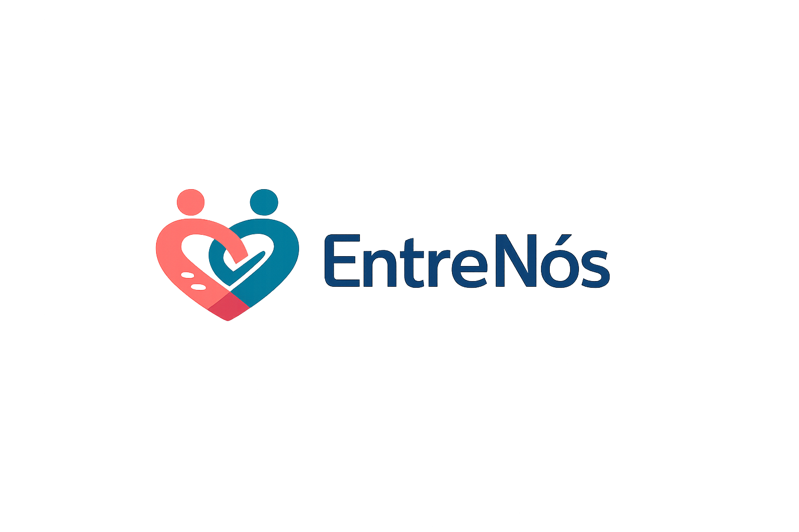
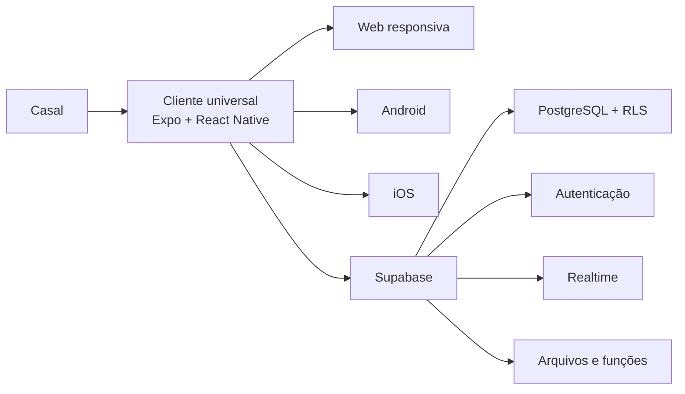

<p align="center">
  
</p>

<h1 align="center">EntreNós</h1>

<p align="center">
  <strong>A vida a dois, organizada com respeito.</strong><br />
  Um aplicativo universal para casais cuidarem da rotina compartilhada sem abrir mão da privacidade individual.
</p>

<p align="center">
  
  
  
  
</p>

> [!IMPORTANT]
> O EntreNós está em desenvolvimento e ainda não possui versão pública. A fundação técnica está implementada; a conexão com os serviços de nuvem e os builds instaláveis são os próximos passos.

## Sobre o produto

O **EntreNós** será um espaço digital privado para duas pessoas organizarem compromissos, decisões, tarefas, compras, despesas e momentos importantes. Em vez de espalhar a rotina entre mensagens, calendários, planilhas e blocos de notas, o casal terá um único ambiente sincronizado e acessível em qualquer dispositivo moderno.

O produto não será uma ferramenta de vigilância. Consentimento, igualdade entre os integrantes e controle sobre o que é pessoal ou compartilhado são regras do sistema — não apenas textos de apresentação.

### Princípios

- **Consentimento explícito:** vínculos, propostas e compartilhamentos dependem da concordância de cada pessoa.
- **Privacidade por padrão:** cada integrante controla a visibilidade das próprias informações.
- **Direitos equivalentes:** não existe um membro com poder absoluto sobre o outro.
- **Transparência:** mudanças importantes deixam histórico e ações críticas podem ser auditadas.
- **Segurança desde a fundação:** autenticação, autorização e isolamento de dados fazem parte do desenho do banco.
- **Tecnologia a serviço do relacionamento:** notificações e automações devem ajudar, nunca pressionar ou controlar.

## Plataformas e responsividade

Uma mesma base de código atende:

- navegadores em computadores e notebooks;
- navegadores em celulares e tablets;
- aplicativo Android;
- aplicativo iOS;
- instalação como PWA em uma evolução futura.

A interface será adaptativa: navegação compacta e conteúdo em uma coluna no celular, melhor aproveitamento lateral em tablets e menus apropriados para telas maiores. O suporte será validado nos navegadores modernos Chrome, Edge, Firefox e Safari.

| Faixa de tela   | Experiência planejada                         |
| --------------- | --------------------------------------------- |
| 320–767 px      | Celulares, toque e navegação compacta         |
| 768–1023 px     | Tablets e dispositivos dobráveis              |
| 1024–1439 px    | Notebooks e desktops                          |
| 1440 px ou mais | Monitores grandes com largura útil controlada |

## Funcionalidades planejadas

### Núcleo do MVP

- Cadastro, login, recuperação de acesso e perfis individuais.
- Criação do espaço do casal e convite seguro do parceiro.
- Dashboard com compromissos, pendências, tarefas e saldo.
- Calendário pessoal e compartilhado.
- Eventos privados, somente ocupado, com título visível ou totalmente compartilhados.
- Propostas, respostas, contrapropostas e detecção segura de conflitos.
- Tarefas domésticas e listas de compras sincronizadas.
- Registro e divisão de despesas do casal.
- Mensagens básicas e conversas relacionadas aos itens.
- Datas importantes e notificações configuráveis.
- Funcionamento essencial em conexão instável.
- Exportação, exclusão de conta e desvinculação segura.

### Evoluções posteriores

- Planejamento de encontros, viagens e refeições.
- Listas de desejos e ideias de presentes.
- Memórias, fotos e documentos importantes.
- Integração com calendários externos.
- Localização temporária, sempre opcional e consentida.
- Assistente de inteligência artificial com permissões explícitas.
- Recursos premium e grupos maiores, caso sejam validados.

O escopo completo está no [Plano Mestre](docs/PLANO_MESTRE.md).

## Etapa atual

Estamos na **Entrega 1 — Fundação executável**, em fase final. O objetivo desta etapa é provar que a mesma aplicação pode ser verificada, testada e gerada para web, Android e iOS antes de desenvolver os módulos do produto.

| Área                       | Estado       | Evidência atual                                     |
| -------------------------- | ------------ | --------------------------------------------------- |
| Planejamento e arquitetura | Concluído    | Escopo, stack e decisões documentados               |
| Cliente universal          | Concluído    | Expo Router para web, Android e iOS                 |
| Interface inicial          | Concluído    | Tema, navegação, marca provisória e duas rotas      |
| Responsividade inicial     | Validada     | Jornada testada em celular e desktop                |
| Regras de privacidade      | Em andamento | Domínio isolado e quatro testes automatizados       |
| Banco inicial              | Preparado    | Migration, RLS, consentimentos e auditoria          |
| Qualidade automatizada     | Concluída    | Formatação, lint, tipos, testes, doctor e exports   |
| Supabase em nuvem          | Parcial      | URL e chave pública validadas; vínculo CLI pendente |
| Builds móveis instaláveis  | Processando  | Build interno Android na fila; iOS pendente         |
| Integração contínua        | Validada     | Jobs de aplicação e banco aprovados no GitHub       |

Após o aceite desta fundação, a próxima entrega implementará o design system completo. Em seguida virão autenticação, perfis e formação segura do casal.

Consulte as evidências e pendências em [Status da Entrega 1](docs/status/ENTREGA_1.md).

## Arquitetura



### Decisões principais

- **Cliente universal:** Expo, React Native, Expo Router e TypeScript.
- **Backend inicial:** Supabase gerenciado.
- **Fonte de verdade:** PostgreSQL versionado por migrations.
- **Autorização:** Row Level Security em todas as tabelas expostas.
- **Estado do servidor:** TanStack Query.
- **Validação:** Zod e regras de domínio independentes da interface.
- **Qualidade:** ESLint, Prettier, TypeScript estrito, Vitest e pgTAP.
- **Entrega:** GitHub Actions e builds EAS.

Os motivos e limites da escolha estão na [decisão de arquitetura](docs/decisions/0001-expo-supabase.md).

## Estrutura do repositório

```text
entrenos/
├── apps/
│   └── client/                 # Aplicação Expo para web, Android e iOS
├── packages/
│   └── domain/                 # Tipos e regras de negócio testáveis
├── supabase/
│   ├── migrations/             # Evolução versionada do PostgreSQL
│   ├── tests/                  # Testes de schema, privilégios e RLS
│   └── seed.sql                # Dados locais não sensíveis
├── scripts/                    # Verificação do ambiente e ativos da marca
├── docs/                       # Produto, arquitetura, segurança e runbooks
└── .github/workflows/          # Qualidade, exports e testes do banco
```

## Executar o projeto

### Pré-requisitos

- Git.
- Node.js 24.
- pnpm 11.9.0.
- Projeto de desenvolvimento no Supabase Cloud, no fluxo recomendado.
- Docker Desktop apenas para quem optar pelo Supabase local.

No PowerShell, confira as ferramentas disponíveis:

```powershell
pnpm env:check
```

O aviso sobre Docker pode ser ignorado quando o projeto estiver usando exclusivamente o Supabase Cloud.

### 1. Instalar as dependências

Na raiz do repositório:

```powershell
pnpm install --frozen-lockfile
```

### 2. Configurar o ambiente do cliente

Crie um arquivo local a partir do exemplo:

```powershell
Copy-Item -LiteralPath 'apps/client/.env.example' -Destination 'apps/client/.env.local'
```

Preencha somente as variáveis públicas do projeto de desenvolvimento:

```dotenv
EXPO_PUBLIC_SUPABASE_URL=https://seu-projeto.supabase.co
EXPO_PUBLIC_SUPABASE_PUBLISHABLE_KEY=sua-chave-publicavel
```

> [!CAUTION]
> Nunca coloque senha do banco, token pessoal ou chave `service_role` em `EXPO_PUBLIC_*`, no Git, em prints ou em mensagens. O arquivo `.env.local` é ignorado pelo repositório.

### 3. Abrir a versão web

```powershell
pnpm web
```

O terminal mostrará o endereço local. Alterações no código serão refletidas durante o desenvolvimento.

### 4. Abrir em um dispositivo móvel

```powershell
pnpm dev
```

Os builds de desenvolvimento com Expo/EAS serão o caminho oficial para testes em aparelhos reais. O Android também poderá usar um emulador com `pnpm android`; o simulador local de iOS exige macOS.

### Banco local opcional

Com Docker Desktop instalado e aberto:

```powershell
pnpm db:start
pnpm db:status
pnpm db:test
```

O guia completo está em [Desenvolvimento local](docs/runbooks/DESENVOLVIMENTO_LOCAL.md).

## Comandos principais

| Comando                   | Resultado                                          |
| ------------------------- | -------------------------------------------------- |
| `pnpm dev`                | Inicia o servidor Expo                             |
| `pnpm web`                | Abre a aplicação no navegador                      |
| `pnpm android`            | Abre o alvo Android disponível                     |
| `pnpm ios`                | Abre o simulador iOS em um Mac                     |
| `pnpm check`              | Formatação, lint, tipos e testes                   |
| `pnpm doctor`             | Verifica a compatibilidade do projeto Expo         |
| `pnpm build:web`          | Gera o export estático da aplicação web            |
| `pnpm build:mobile`       | Gera bundles de validação para Android e iOS       |
| `pnpm audit:dependencies` | Verifica vulnerabilidades altas e críticas         |
| `pnpm assets:generate`    | Recria os ativos provisórios da marca              |
| `pnpm db:start`           | Inicia o Supabase local                            |
| `pnpm db:stop`            | Encerra o Supabase local preservando os dados      |
| `pnpm db:reset`           | Recria exclusivamente o banco local                |
| `pnpm db:lint`            | Analisa o PostgreSQL local                         |
| `pnpm db:test`            | Testa schema, funções, privilégios e políticas RLS |

Antes de enviar qualquer alteração, execute:

```powershell
pnpm check
pnpm doctor
pnpm build:web
pnpm build:mobile
```

## Segurança e privacidade

- Nenhuma tabela exposta pode existir sem RLS e teste de isolamento.
- IDs recebidos do cliente nunca são suficientes para autorizar uma ação.
- Informações privadas retornam apenas os campos permitidos ao solicitante.
- Convites armazenam o hash do token, não o token utilizável.
- Consentimentos são registrados de forma histórica.
- Operações críticas devem ser transacionais, idempotentes e auditáveis.
- Desenvolvimento, homologação e produção terão projetos e credenciais separados.
- Dados reais de usuários não serão copiados para desenvolvimento.

O projeto seguirá boas práticas relacionadas à LGPD, mas a operação pública também dependerá de revisão jurídica independente, política de privacidade, termos de uso e processos organizacionais.

Leia [Ambientes e segredos](docs/runbooks/AMBIENTES_E_SEGREDOS.md) e [Riscos de dependências](docs/security/DEPENDENCY_RISKS.md).

## Roadmap resumido

1. **Fundação executável:** projeto universal, banco inicial, testes e CI — etapa atual.
2. **Design system:** componentes, acessibilidade e estados de interface.
3. **Identidade e vínculo:** autenticação, perfis e convite do casal.
4. **Calendário:** privacidade, propostas, contrapropostas e conflitos.
5. **Organização:** tarefas e compras compartilhadas.
6. **Finanças:** despesas, divisões, saldos e auditoria.
7. **Comunicação:** mensagens e notificações.
8. **Privacidade e LGPD:** exportação, exclusão e desvinculação.
9. **Resiliência:** offline, segurança, backups e observabilidade.
10. **Beta e publicação:** builds assinados, testes controlados e lançamento.

Cada entrega precisa funcionar de ponta a ponta, possuir testes proporcionais ao risco e ser verificável antes de a próxima começar.

## Documentação

- [Plano Mestre de Desenvolvimento](docs/PLANO_MESTRE.md)
- [Playbook para futuros aplicativos](docs/PLAYBOOK_PARA_FUTUROS_APPS.md)
- [Decisão: Expo e Supabase](docs/decisions/0001-expo-supabase.md)
- [Guia de desenvolvimento local](docs/runbooks/DESENVOLVIMENTO_LOCAL.md)
- [Ambientes e segredos](docs/runbooks/AMBIENTES_E_SEGREDOS.md)
- [Riscos conhecidos de dependências](docs/security/DEPENDENCY_RISKS.md)
- [Status detalhado da Entrega 1](docs/status/ENTREGA_1.md)

## Situação do repositório

Este é um projeto privado em desenvolvimento. Contas de provedores, credenciais, dados fiscais e decisões de publicação pertencem ao responsável pelo produto. Nenhum segredo deve ser inserido em issues, commits ou documentação.

---

<p align="center">
  <strong>EntreNós</strong> — organização compartilhada com privacidade individual.
</p>
