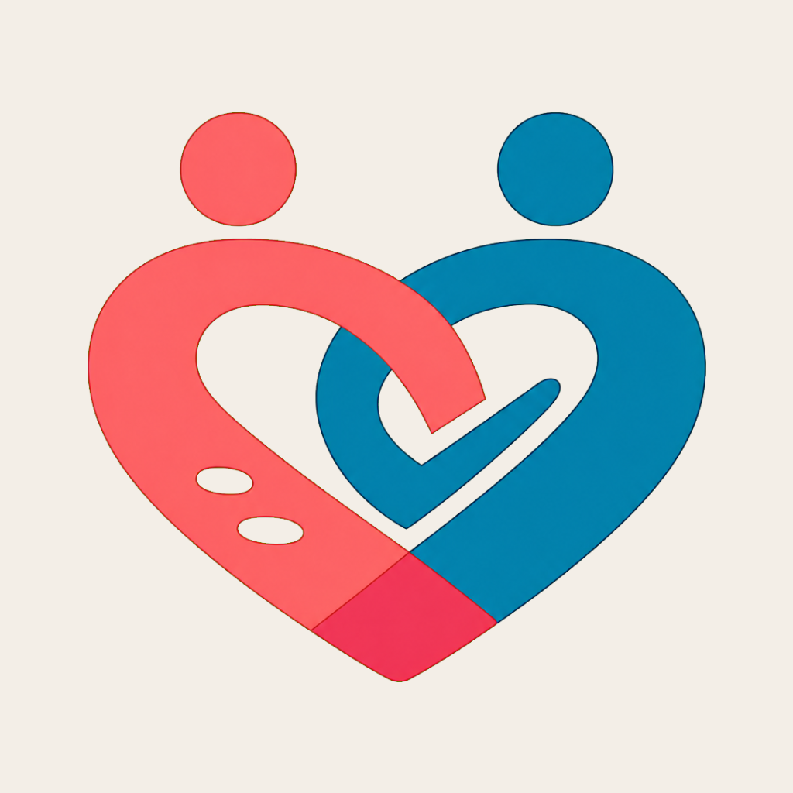

# EntreNós

  

Aplicativo universal para organização da vida a dois, construído com privacidade, consentimento, igualdade e transparência como regras do domínio.
<h1 align="center">EntreNós</h1>

## Estado da Entrega 1

  <strong>A vida a dois, organizada com respeito.</strong> 
  Um aplicativo universal para casais cuidarem da rotina compartilhada sem abrir mão da privacidade individual.

A fundação contém:

  
  
  
  

- monorepo pnpm com versões fixadas;
- cliente Expo/React Native para Android, iOS e web;
- navegação inicial e tema claro/escuro;
- pacote de regras de domínio com testes de privacidade;
- configuração local do Supabase;
- migration inicial com perfis, espaços, membros, convites, consentimentos e auditoria;
- RLS e função transacional para criar um espaço;
- configuração de builds EAS;
- CI para qualidade, exports e testes do banco;
- documentação de ambiente e segredos.
> [!IMPORTANT]
> O EntreNós está em desenvolvimento e ainda não possui versão pública. A fundação técnica está implementada; a conexão com os serviços de nuvem e os builds instaláveis são os próximos passos.

## Sobre o produto

O **EntreNós** será um espaço digital privado para duas pessoas organizarem compromissos, decisões, tarefas, compras, despesas e momentos importantes. Em vez de espalhar a rotina entre mensagens, calendários, planilhas e blocos de notas, o casal terá um único ambiente sincronizado e acessível em qualquer dispositivo moderno.

O produto não será uma ferramenta de vigilância. Consentimento, igualdade entre os integrantes e controle sobre o que é pessoal ou compartilhado são regras do sistema — não apenas textos de apresentação.

### Princípios

- **Consentimento explícito:** vínculos, propostas e compartilhamentos dependem da concordância de cada pessoa.
- **Privacidade por padrão:** cada integrante controla a visibilidade das próprias informações.
- **Direitos equivalentes:** não existe um membro com poder absoluto sobre o outro.
- **Transparência:** mudanças importantes deixam histórico e ações críticas podem ser auditadas.
- **Segurança desde a fundação:** autenticação, autorização e isolamento de dados fazem parte do desenho do banco.
- **Tecnologia a serviço do relacionamento:** notificações e automações devem ajudar, nunca pressionar ou controlar.

## Plataformas e responsividade

Uma mesma base de código atende:

- navegadores em computadores e notebooks;
- navegadores em celulares e tablets;
- aplicativo Android;
- aplicativo iOS;
- instalação como PWA em uma evolução futura.

A interface será adaptativa: navegação compacta e conteúdo em uma coluna no celular, melhor aproveitamento lateral em tablets e menus apropriados para telas maiores. O suporte será validado nos navegadores modernos Chrome, Edge, Firefox e Safari.

| Faixa de tela    | Experiência planejada                            |
| ---------------- | ------------------------------------------------ |
| 320–767 px       | Celulares, toque e navegação compacta            |
| 768–1023 px      | Tablets e dispositivos dobráveis                 |
| 1024–1439 px     | Notebooks e desktops                             |
| 1440 px ou mais  | Monitores grandes com largura útil controlada    |

## Funcionalidades planejadas

### Núcleo do MVP

- Cadastro, login, recuperação de acesso e perfis individuais.
- Criação do espaço do casal e convite seguro do parceiro.
- Dashboard com compromissos, pendências, tarefas e saldo.
- Calendário pessoal e compartilhado.
- Eventos privados, somente ocupado, com título visível ou totalmente compartilhados.
- Propostas, respostas, contrapropostas e detecção segura de conflitos.
- Tarefas domésticas e listas de compras sincronizadas.
- Registro e divisão de despesas do casal.
- Mensagens básicas e conversas relacionadas aos itens.
- Datas importantes e notificações configuráveis.
- Funcionamento essencial em conexão instável.
- Exportação, exclusão de conta e desvinculação segura.

### Evoluções posteriores

- Planejamento de encontros, viagens e refeições.
- Listas de desejos e ideias de presentes.
- Memórias, fotos e documentos importantes.
- Integração com calendários externos.
- Localização temporária, sempre opcional e consentida.
- Assistente de inteligência artificial com permissões explícitas.
- Recursos premium e grupos maiores, caso sejam validados.
